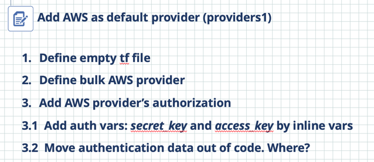

# How to start:

1. Review exercise's description in the original presentation (pdf).
It looks like: 
2. **Start each exercise from empty directory**, you shouldn't use hints (files) in exercise's folder.
3. Use exercise`s README.md file **only** if you have no idea how to complete steps.
4. Each Readme consist steps to complete from A to Z, ex: [./providers/README.md](./providers/README.md). (Default AWS profile named `tf-training` to avoid working with other pre-setup AWS infrastructure)
5. Each exercise folder consist final working version, check this after completing the exercises yourself.
6. Remove resources after completing exercises.

# Exercises map

+ Terraform providers management
  + [Providers](./providers1/) 
+ Main commands:
  + [Init](./init1)
+ State management:
  + [Basics](./state1)
  + [Moving resources](./state_mv1) 
  + [Delayed resource management](./state2)
  + [Remote-state](./remote-state1)
+ Variables:
  + [Definition methods](./vars1)
  + [Validation](./var-def1)
  + [Local](./locals1) variables
  + [Outputs](./output1)
+ Resource management
  + [Import](./import1)
  + [Replace](./replace1) resources
  + EC2 Instance: generate [ssh keypair](./ec2-ssh)
+ Terraform [modules](./m1)
+ Extended HCL syntax
  + [For_each](./for1)
  + [Dynamic](./dyn1)
+ Miscellaneous
  + [Lifecycle management](./lifecycle1)
  + [Workspaces](./wspace1)
  + [Version management](./ver1)
  + [Provisioners](./prov1)
  + [Debugging](./debug1)    
  