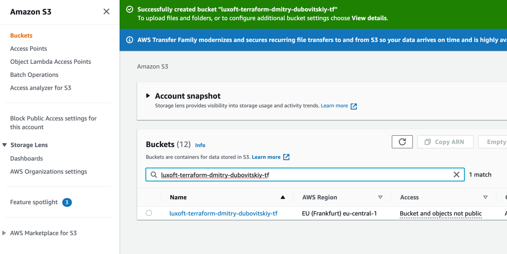

1. Open AWS Console and locate on S3 Service

Select **eu-central-1** region
Create new bucket by template:

  **luxoft-terraform-_-_-tf**

So, the final bucket will looks like:


**!Note:** Bucket naming have cloud limitations:
main are lowercase, length: 3-63 symbols, bucket name is global for whole AWS
https://docs.aws.amazon.com/AmazonS3/latest/userguide/bucketnamingrules.html


2. Define terraform backend config

Type next backend config, **replace**  with personal credentials:
````
terraform {
  backend "s3" {
    bucket = "luxoft-terraform---tf"
    key = "tf-training.tfstate"
    profile = "tf-training"
  }
}
````

Note: Terraform doesn't support variables in bucket name

3. Init the new backend config via: 

`terrafrom init`

4. Open created backet and review for state content:

Download _tf-training.tfstate_ and review

5. Delete bucket with content using AWS Console

---

### Help:

**Error:** 
````NoSuchBucket: The specified bucket does not exist
│ 	status code: 404, request id: ...
````
**Solution:** 

Check bucket existing and bucket name in 1)


**Error:**
````
│ Error: error configuring S3 Backend: error validating provider credentials: error calling sts:GetCallerIdentity: InvalidClientTokenId: The security token included in the request is invalid.
│ 	status code: 403,
````
**Solution:**

Check environment variables:
_export AWS_ACCESS_KEY_ID_
_export AWS_SECRET_ACCESS_KEY_

Shouldn't use it for authentication, unset if necessary
`unset AWS_ACCESS_KEY_ID`
`unset AWS_ECRET_ACCESS_KEY`


